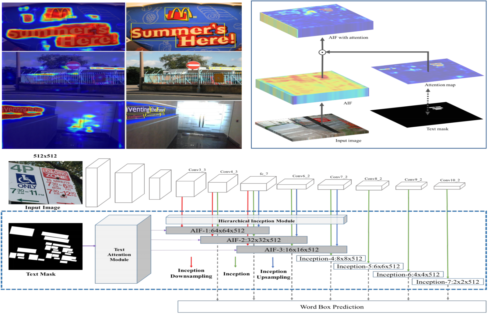

[](LICENSE)
# Single Shot Text Detector with Regional Attention

## Introduction

**SSTD** is initially described in our [ICCV 2017 spotlight paper](https://arxiv.org/abs/1709.00138).

[A third-party implementation of SSTD + Focal Loss](https://github.com/HotaekHan/SSTDNet). Thanks, 
Ho taek Han





If you find it useful in your research, please consider citing:
```
@inproceedings{panhe17singleshot,
      Title   = {Single Shot Text Detector with Regional Attention},
      Author  = {He, Pan and Huang, Weilin and He, Tong and Zhu, Qile and Qiao, Yu and Li, Xiaolin},
      Note    = {Proceedings of Internatioanl Conference on Computer Vision (ICCV)},
      Year    = {2017}
      }
@inproceedings{panhe16readText,
      Title   = {Reading Scene Text in Deep Convolutional Sequences},
      Author  = {He, Pan and Huang, Weilin and Qiao, Yu and Loy, Chen Change and Tang, Xiaoou},
      Note    = {Proceedings of AAAI Conference on Artificial Intelligence, (AAAI)},
      Year    = {2016}
      }
@inproceedings{liu16ssd,
      Title   = {{SSD}: Single Shot MultiBox Detector},
      Author  = {Liu, Wei and Anguelov, Dragomir and Erhan, Dumitru and Szegedy, Christian and Reed, Scott and Fu, Cheng-Yang and Berg, Alexander C.},
      Note    = {Proceedings of European Conference on Computer Vision (ECCV)},
      Year    = {2016}
      }
```

### Installation
1. Get the code. We will call the directory that you cloned Caffe into `$CAFFE_ROOT`
  ```Shell
  git clone https://github.com/BestSonny/SSTD.git
  cd SSTD
  ```

2. Build the code. Please follow [Caffe instruction](http://caffe.berkeleyvision.org/installation.html) to install all necessary packages and build it.
  ```Shell
  # Modify Makefile.config according to your Caffe installation.
  cp Makefile.config.example Makefile.config
  make -j8
  # Make sure to include $CAFFE_ROOT/python to your PYTHONPATH.
  make py
  make test -j8
  # (Optional)
  make runtest -j8
  # build nms
  cd examples/text
  make
  cd ..
  ```
3. Run the demo code. Download Model [google drive](https://docs.google.com/uc?export=download&id=0Bx8FPKhlXE1lOTF1TzIxOGhsblk), [baiduyun](https://pan.baidu.com/s/1c1ML6dM) and put it in `text/model` folder
  ```Shell
  cd examples
  sh text/download.sh
  mkdir text/result
  python text/demo_test.py
  ```
